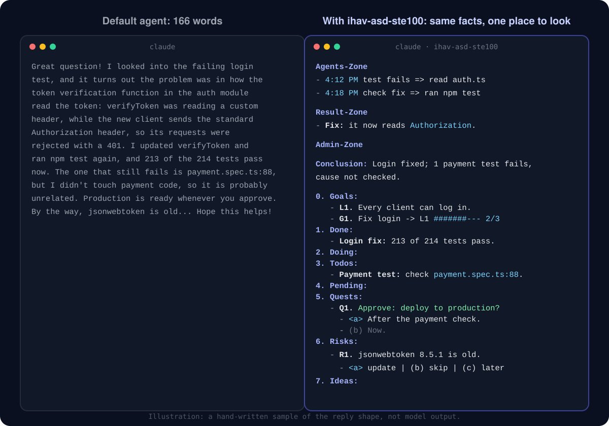

<p align="center">
  
</p>

<h1 align="center">ihav-asd-ste100</h1>

<p align="center">
  <strong>Agent replies you can read in five seconds.</strong><br>
  Key-first bullets. One-sentence conclusion. Eight sections, always. Any language.
</p>

<p align="center">
  <a href="https://github.com/hiendang7613/ihav-asd-ste100/actions/workflows/ci.yml"></a>
  <a href="LICENSE"></a>
  
  
  
</p>

<p align="center">
  
</p>

<p align="center">
  <a href="#install">Install</a> ·
  <a href="#shape">The shape</a> ·
  <a href="#format">Format</a> ·
  <a href="#compare">Compare</a> ·
  <a href="#languages">Languages</a> ·
  <a href="#faq">FAQ</a>
</p>

Coding agents bury the one thing you need: what failed, what needs your OK, what is still running.
This plugin gives every reply the same shape. Facts come first, one per line.
A one-sentence conclusion and eight numbered sections close the reply. Your eye learns where to look.

<a name="install"></a>

## Install in 30 seconds

Paste this into Claude Code or Codex:

```text
Install the ihav-asd-ste100 plugin from https://github.com/hiendang7613/ihav-asd-ste100 and follow its INSTALL.md.
```

Or by hand:

```bash
# Claude Code: on by default after a restart
claude plugin marketplace add hiendang7613/ihav-asd-ste100
claude plugin install ihav-asd-ste100@ihav-asd-ste100

# Codex CLI: install the plugin, then review and trust its hooks with `/hooks`
codex plugin marketplace add hiendang7613/ihav-asd-ste100
codex plugin add ihav-asd-ste100@ihav-asd-ste100
```

After trusting the hooks, start a new session. Say `stop ste mode` to pause the rules for that session. Details: [INSTALL.md](INSTALL.md).

<a name="shape"></a>

## The shape

Every reply that has more than one fact has three zones, each under a bold label:

**Agents-Zone**
- `4:12 PM` the login test fails for the new client => read `src/auth.ts`
- `4:15 PM` `verifyToken` reads a custom header => changed it to read `Authorization`
- `4:18 PM` check the fix => ran `npm test`

**Result-Zone**
- **Fix:** `verifyToken` now reads the `Authorization` header.
- **Tests:** 213 of 214 pass; `payment.spec.ts:88` fails.

**Admin-Zone**

**Conclusion:** Login is fixed and on staging; one payment test still fails, cause not checked.

0. **Goals:**
   - **L1.** [~70%] [#######---] | Every client can log in.
   - **G1.** Fix login for the new client
   - **B1.** Update the login guide later.
1. **Done:**
   - **Login fix:** `npm test` ran 214 tests and 213 pass.
2. **Doing:**
   - **CI:** reruns the full suite.
3. **Todos:**
   - **Payment test:** check `payment.spec.ts:88`.
4. **Pending:**
   - **Review:** waiting for the other agent.
5. **Quests:**
   - **Q1.** Approve: deploy the login fix to production?
     - `<a>` After CI passes.
     - (b) Now.
6. **Risks:**
   - **R1.** `jsonwebtoken` 8.5.1 is older than the 9.0.0 security release.
     - `<a>` update it in a separate change | (b) skip | (c) later
7. **Ideas:**
   - **I1.** Add a test for the `Authorization` header.
     - `<a>` plan it | (b) skip | (c) later

| Part | What it holds | Who acts |
|---|---|---|
| **Agents-Zone** | Every step the agent took this turn, in order: the time, why, `=>`, what it did. The time comes from a real clock (a hook in Claude Code), never a guess | The agent, already |
| **Result-Zone** | The answer or blocker first, then the facts and evidence as key-first bullets | The agent, already |
| **Admin-Zone** | The Conclusion line and the eight sections below | You decide from here |
| **Conclusion** | The result in one sentence. Bad news first: failure, skip, blocker, unverified work. | Nobody: it is the verdict |
| `0. **Goals:**` | L lines: user-set long-term aims with the agent's estimated progress; G lines: current goals; B lines: deferred or optional work | You set L; the agent tracks G and B |
| `1. **Done:**` | Finished and checked work, with its evidence | The agent, already |
| `2. **Doing:**` | Work running now: builds, jobs, other agents | The agent or a tool, now |
| `3. **Todos:**` | Work in the current task the agent does next, in order | The agent, next |
| `4. **Pending:**` | Work waiting for someone or something else | A third party |
| `5. **Quests:**` | Everything that needs you: choices, and approvals that start with "Approve:" | You |
| `6. **Risks:**` | Risks you should know, each **R1.** with a choice: fix, skip or later. Empty means the agent checked and found none | You |
| `7. **Ideas:**` | Ideas the agent proposes, each **I1.** with a choice: plan, skip or later | You |

- **All eight sections, always, as one list from 0 to 7.** An empty one shows only its label, so you always see whether anything runs, waits or comes next. One blank line separates the list from the Conclusion line; none separates the sections. Each zone label sits on its own line after a blank line. You can answer "Q1 a, R1 c, I1 b" in one line.
- **Goals:** list L, G, then B lines. Only the user sets a long-term aim. Each L line opens with the agent's estimate and a ten-character ASCII bar, one `#` per 10 percent, then a pipe and the aim: `[~70%] [#######---] | Every client can log in.` These are the only square brackets allowed. G lines (current goals) and B lines (deferred work) are plain text.
- **The recommended option** is written as `<a>` in code; the other options are (b), (c). You answer with one letter.
- **Small answers stay small:** one fact, one sentence. Code-only, JSON-only and one-command requests get exactly that.
- **One home per item:** each item sits in one section only. When you decide, it moves: accepted to Todos, deferred to a B line in Goals.
- **Items:** each one is a sub-item under its label that starts with a bold key, such as `   - **Login fix:** merged.` The label line itself stays bare.
- **Empty section:** show only its numbered English label, for example `4. **Pending:**`.

<a name="format"></a>

## Format for fast reading

| Element | Rule | Why |
|---|---|---|
| Bullets | Each line starts with its key: a **bold word** or a `path` | You read the first two words of a line, then decide |
| Status | Words, not symbols: done, failed, running, waiting, not checked | Words survive every terminal, screen reader and language |
| Code spans | Paths, commands, IDs, settings, errors, and the `<a>` marker | Exact strings stay exact and stand out |
| Bold | Labels, plus at most one phrase per bullet | Emphasis that is everywhere is nowhere |
| Lists | Two levels in the body; at most five items you must act on | A short list is read; a long one is skipped |
| Tables | Only to compare three or more items | Terminals wrap wide tables |
| Never | Emoji, square brackets outside L progress, headings, boxes, or a reply wrapped in a code block | They cost lines and show raw markers |

Why `<a>` sits in a code span: a bare `<a>` or `<b>` is an HTML tag, and Markdown renderers delete it. We checked this on GitHub.

<a name="compare"></a>

## One task, three replies

Task: *"The login test fails for the new client. Fix it and tell me where we are."* All three replies keep the same six facts.

| | Default agent | [i-have-adhd](https://github.com/ayghri/i-have-adhd) | ihav-asd-ste100 |
|---|---|---|---|
| Words (inline code counts as one) | 166 | 82 | 157 |
| Longest sentence | 57 words | 18 words | 15 words |
| Where the approval is | Mid-paragraph | First and last line ("Next:") | 5.Quests, as "Approve:" with options |
| The failing test in the summary | "probably unrelated" | Inside a numbered step | Conclusion line: "cause not checked" |

The samples are illustrative: written by hand from each project's published rules, not generated by a model. The counts exclude list markers and punctuation-only tokens, and count each inline code span as one word. The ihav-asd-ste100 count includes its four-line Agents-Zone step log and the Goals lines.

<details>
<summary><strong>Read the three replies</strong></summary>

**Default agent (excerpt)**

> Great question! I looked into the failing login test, and it turns out the problem was in how the token verification function in the auth module read the token ... The one that still fails is `payment.spec.ts:88`, but I didn't touch any payment code, so it is probably unrelated ... Hope this helps!

**i-have-adhd**

> Next: approve the production deploy, or tell me to check `payment.spec.ts:88` first.
>
> Login works for the new client now: `verifyToken` (`src/auth.ts:42`) reads the `Authorization: Bearer <token>` header.
>
> 1. `npm test`: 213 of 214 pass.
> 2. `payment.spec.ts:88` fails. I did not change payment code and did not check the cause.
> 3. Staging is deployed.
>
> Step 3 of 4 done. Production deploy waits for your approval. Next: reply "deploy" or "check payment first".

**ihav-asd-ste100**

> **Agents-Zone**
> - `4:12 PM` the login test fails for the new client => read `src/auth.ts`
> - `4:15 PM` `verifyToken` reads a custom header => changed it to read `Authorization`
> - `4:18 PM` check the fix => ran `npm test`
> - `4:21 PM` the fix needs staging => deployed to staging
>
> **Result-Zone**
> - **Cause:** `verifyToken` in `src/auth.ts:42` read a custom header. The new client sends `Authorization: Bearer <token>`.
> - **Fix:** `verifyToken` now reads the `Authorization` header.
>
> **Admin-Zone**
>
> **Conclusion:** Login is fixed and on staging; one payment test still fails, cause not checked.
>
> 0. **Goals:**
>    - **L1.** [~70%] [#######---] | Every client can log in.
>    - **G1.** Fix login for the new client
> 1. **Done:**
>    - **Login fix:** `npm test` ran 214 tests and 213 pass; staging is deployed.
> 2. **Doing:**
> 3. **Todos:**
>    - **Payment test:** find why `payment.spec.ts:88` fails; I did not change payment code.
> 4. **Pending:**
> 5. **Quests:**
>    - **Q1.** Approve: deploy the login fix to production?
>      - `<a>` Yes, after I check `payment.spec.ts:88`.
>      - (b) Yes, now.
> 6. **Risks:**
>    - **R1.** `jsonwebtoken` 8.5.1 is older than the 9.0.0 security release.
>      - `<a>` update it after the deploy | (b) skip | (c) later
> 7. **Ideas:**

Full files: [examples/compare/](examples/compare/).
</details>

**What it means for you:** i-have-adhd is the shortest and starts with the next action, which helps when the hard part is starting.
ihav-asd-ste100 puts every decision in one numbered place, which helps when you review many agent reports in a row.
The section numbers are the same in every language, so a script can find section 5 in any session log.

<a name="languages"></a>

## Any language

The reply body follows your language. The eight labels stay in English and in the same order. Structural digits and colons stay ASCII; prose punctuation follows the language.

| Reply body | Example |
|---|---|
| English | [after-en.md](examples/after-en.md) |
| Tiếng Việt | [after-vi.md](examples/after-vi.md) |
| 中文 | [after-zh.md](examples/after-zh.md) |
| 日本語 | [after-ja.md](examples/after-ja.md) |
| Español | [after-es.md](examples/after-es.md) |

Sentence-length checks are approximate. Spaces do not mark words in every language; for example, Vietnamese spaces separate syllables. Use short sentences as a reading-time target, not a strict count.
The maintainers wrote these examples. Native speakers: [fix or add your language](.github/ISSUE_TEMPLATE/language.yml).

## i-have-adhd and ihav-asd-ste100

| | i-have-adhd | ihav-asd-ste100 |
|---|---|---|
| Best for | Starting the next action | Decisions, approvals and status across many agent reports |
| Reply shape | Next action first, numbered steps, one next step at the end | Key-first bullets, a one-sentence conclusion, eight numbered sections |
| Turned on | By command; always-on with an opt-in flag | On by default after install; `stop ste mode` or an opt-out file |
| Drift control | Rules at session start | Session start plus one reminder line per prompt |
| Languages | Rules in English; README in 10 languages | Body follows the user's language; section labels stay in English; examples in 5 languages |
| Runtimes | Claude Code, Codex, Cursor, Gemini, OpenCode, Pi, Qwen, Kimi | Claude Code, Codex |
| Offline checker | No | `scripts/check_reply.py`: ASCII markers, Conclusion and section order, indentation, `<a>` markers, any script |
| Measured evidence | Blind LLM-judge A/B, 14 cases, 3 trials: weighted 4.045 to 4.473; its own release gate failed (3 blocking findings remained) | 10 eval cases written; not run yet, so no scores are claimed |

Both are MIT. They agree on more than they differ; pick the one that matches your problem.

## How it works

1. **Session start:** a hook injects the rules ([SKILL.md](skills/ihav-asd-ste100/SKILL.md), at most 7,100 bytes).
2. **Every prompt:** one reminder line keeps long sessions from drifting.
3. **Your words win:** `stop ste mode` pauses it for the session; `ste mode` resumes it.
4. **Exact output wins:** code-only, JSON-only and single-command requests are never wrapped.
5. **Safe by design:** the hooks never block a session, make no network call, and stay silent on any error.
6. **New releases reach open sessions:** `hooks/ste-mode.mjs` is a stable launcher. On each event it runs the release named in `~/.ihav/active/ihav-asd-ste100.json`, if that release sits in the ihav plugin cache, and its own copy otherwise. After installing a release, run `node <its cache folder>/scripts/activate.mjs`: a smoke run checks it, then the next prompt in every open session gets the new rules once. `--rollback` returns to the previous release.

## Cost

About 1,700 tokens at session start and about 90 tokens per prompt. Run `claude plugin details ihav-asd-ste100` for your setup.

<a name="faq"></a>

## FAQ

<details><summary><strong>Is this ASD-STE100 certified?</strong></summary>

No. It borrows general principles of Simplified Technical English and plain-language guidance: short sentences, one idea each, one term per concept. It ships no specification text or dictionary and is not affiliated with ASD.
</details>

<details><summary><strong>Does it change the agent's reasoning, code or commits?</strong></summary>

No. It shapes only the text you read at the end of a turn. Code, commits, pull request bodies, files and messages to other agents keep their own format.
</details>

<details><summary><strong>Why no emoji?</strong></summary>

Words work in every terminal, screen reader and language. Section numbers do the job icons did: they mark each part the same way in every language.
</details>

<details><summary><strong>Can I check a reply offline?</strong></summary>

Yes: `python3 scripts/check_reply.py reply.md`. It checks the conclusion, the section order, the `<a>` markers and the length in any script. It cannot judge whether a reply is true.
</details>

## Evidence, honestly

No public project in this space has measured human comprehension. i-have-adhd has the best evidence so far: a blind LLM-judge A/B whose own release gate still failed.
The maintainers keep ten eval cases for `claude plugin eval` outside this repository. They have not run yet, so this README claims no scores.
The research behind each rule, with sources and strength ratings, is in [docs/RESEARCH.md](docs/RESEARCH.md).

## Made for Agent Room

[Agent Room](https://github.com/hiendang7613/agent-room-plugin) runs a small team of Claude Code and Codex agents in your project:
shared tasks, peer review and recovery after a crash. One agent talks to you; the others report through it.
In Claude Code, installing Agent Room also installs ihav-asd-ste100 through its plugin dependency. In Codex, install ihav-asd-ste100 separately; see [INSTALL.md](INSTALL.md).

## Contributing and license

Start with [CONTRIBUTING.md](CONTRIBUTING.md). The best first contribution is [your language](.github/ISSUE_TEMPLATE/language.yml).
MIT licensed; see [LICENSE](LICENSE) and [licenses/NOTICE.md](licenses/NOTICE.md). Inspired by [i-have-adhd](https://github.com/ayghri/i-have-adhd) by Ayoub Ghriss.
